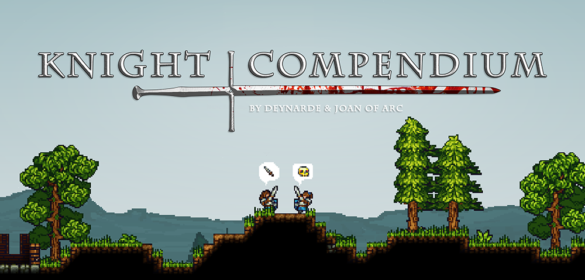

--- 
title: "Knight Compendium"
author: "by Eluded and deynarde"
date: "`r format(Sys.time(), '%d/%m/%Y')`"
site: bookdown::bookdown_site
output: bookdown::gitbook
documentclass: book
bibliography: [latex/book.bib, latex/packages.bib]
biblio-style: apalike
link-citations: yes
github-repo: deynarde/kag-knight-compendium
description: "A KAG collection of all the tricks and techniques that knights can perform."
---

# Introduction {-}

  

KNIGHT COMPENDIUM IS OUTDATED AND BROKEN, SEE https://deynarde.github.io/kag-knight-guide/ FOR A COMPLETE KNIGHT GUIDE

~~Welcome to deynarde & Joan of Arc's (Eluded) Knight Compendium.~~

~~This is not a guide to playing knight, but rather a collection of all the tricks and techniques that knights can perform. Each move is accompanied by some explanation as well as an animated GIF.~~

~~Through this compendium we want to show that there is far more to knight combat than some may think; at a high level a knight has a myriad of different tactics with which to outwit his/her opponents – and it is this complexity which makes knight combat interesting and fun.
If you can master every technique here then you will become a fearsome opponent indeed!~~

~~We want this list to be as comprehensive as possible, so if you know an interesting move that we have missed – do tell one of us either over the forums or in game.~~

> Also you can contact us on [KAG Discord](https://discord.gg/kag) (`Eluded#1367`, `deynarde#4491`).
